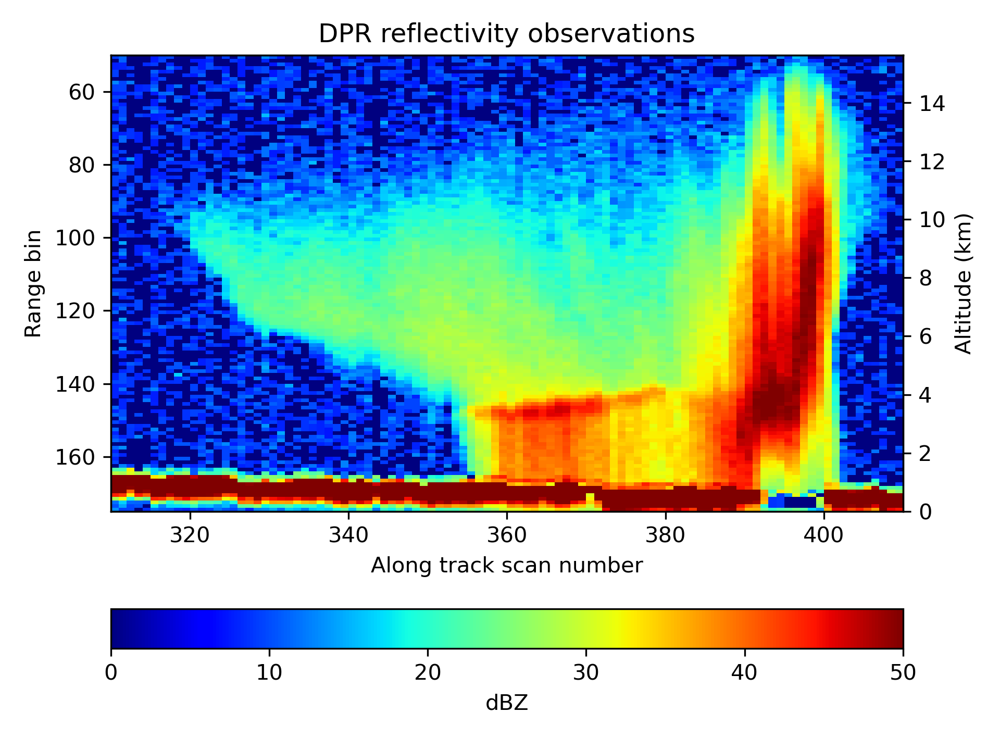
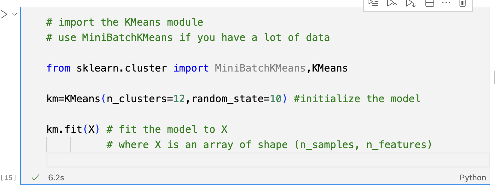
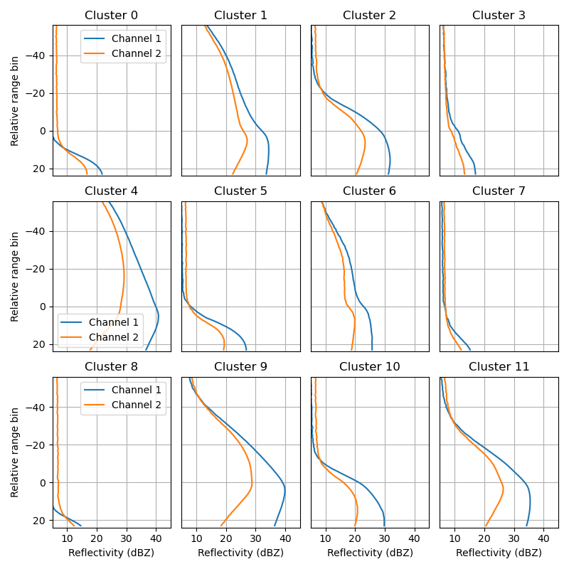
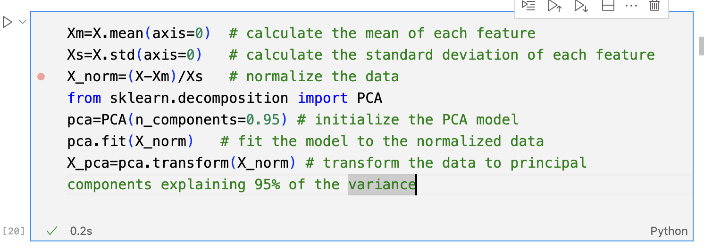
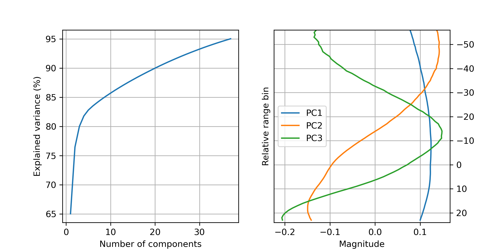

# A rainy introduction to ML

## Introduction

The purpose of this note is to provide a concise, yet not superficial,illustration of the most basic concepts in machine learning (ML) using data from the NASA Global Precipitation Measurement (GPM) mission. Details on the GPM mission may be found in Skofronick-Jackson et al. (2017). The GPM core observatory satellite caries a dual frequency precipitation radar (DPR) that provide three-dimensional atmospheric observations, with two horizontal dimensions and the third one in the vertical direction. For the purpose of this presentation, I will consider the observations one dimensional. Surface precipitation estimates derived from the DPR observation using the DPR precipitation algorithm (Iguchi et al. 2010) will be used as well to illustrate ML concepts.

Machine learning is a technical and scientific discipline that focuses on development of algorithms that enable computers to solve tasks by learning from data. As the ultimate goal is often to predict a variable $\mathbf{y}$ (that can be categorical or continuous) from a variable $\mathbf{X}$, ML is closely related to statistics. However, although a great deal of convergence has occurred lately, given the fact that ML emerged in an application driven context and continues to evolve due to contributions originating outside the field of statistics, there are still distinctions between the two disciplines. A non-technical introduction to ML may be found in Colliot (2023). In ML, the variable $\mathbf{y}$ is called the target variable, and the variables in $\mathbf{X}$ are called the features. The features are used to predict the target variable. The features are often called the independent variables, and the target variable is often called the dependent variable. The target variable $y$ is sometimes more difficult to acquire than the features. In the case of the GPM data, the target variable is the surface precipitation, while the features are the DPR observations. It goes without saying that the development of an ML algorithm to predict $\mathbf{y}$ from $\mathbf{X}$ requires a dataset that contains both $\mathbf{y}$ and $\mathbf{X}$, while the development and deployment of an instrument might provide only $\mathbf{X}$ like in the case of the DPR. Datasets that contain $\mathbf{X}$ but no $\mathbf{y}$ are usually called unlabeled datasets. ML can still be useful in such cases, as it can be used to find patterns in the data that can simplify the process of labeling the datasets or making predictions once the dataset is labeled. ML that involves processing of unlabeled data is called unsupervised learning. ML that involves processing of labeled data is called supervised learning.

In this introduction, the DPR observations will be used to illustrate unsupervised learning concepts as clustering and the principal component analysis (PCA), while the surface precipitation estimates derived by the DPR precipitation algorithm will be used to illustrate supervised learning concepts. The popular Python library scikit-learn (Pedregosa et al. 2011) will be used in the illustration.

# Unsupervised learning

As already mentioned, unsupervised learning is a type of ML where an algorithm is trained on a dataset without labels. The goal of unsupervised learning is to find patterns in the data that can be used to simplify the process of labeling the data or making predictions oncethe data is labeled. Shown in Fig. [1] are the unprocessed observations from the GPM DPR instruments. The DPR is onboard a satellite that orbits the Earth and probes the atmosphere in 49 different directions at the same time (out of which one is perfectly perpendicular to the Earth). The power emitted by the radar and reflected back to the satellite is binned into short-time intervals that are equivalent to ranges from the radar (or altitude above the sea level). As the DPR keeps moving around the Earth, it collects data that can be used to create a three-dimensional image of the atmosphere. The data shown in Fig. [1] is two-dimensional, as it consists of observations collected normally to the surface of the Earth with the other direction given by the satellite movement. As apparent from the figure, there is a lot of variability in the data suggestive of atmospheric processes. From this perspective, an unsupervised analysis of the data is insightful. For example, the greenish portions of the image (values larger than 20 dBZ) at rang bins shorter than 140 are indicative of snow, while the red colors (values larger than 35 dBZ) at ranges shorter than 140 are indicative of dense ice particles such graupel and hail. The range bin size is 125 m with the Earth ellipsoid at range bin 175. The intense colors at range larger than 160 are indicative of return by the Earth rather than the atmosphere. To eliminate artifacts due to the ground return and variability in the height of the $0^\circ$ C altitude, I remove the lowest 16 bin observations and shift the observations such that the $0^\circ$ C bin corresponds to the same row in $\mathbf{X}$. Also, I discarded the observations more than 60 bins above the $0^\circ$ C bin and 25 bins below it. Moreover, for simplicity, I only selected profiles classified as convective by the DPR algorithm. This type of data cleaning, filtering and selection is common in ML and is called data preprocessing.

Fig 1. Radar observations from the GPM DPR.

  
One way of achieving this is by randomly partitioning the dataset K cluster and calculate their centers. Then each data point is reassigned to the cluster with the closest cluster center, and the process is repeated until the cluster centers no longer change. Code to perform the K-Means clustering using sklearn is shown in Fig. [2]. The result of the clustering for K=12 is shown in Fig. [3].
***Once trained, a K-means model can be used to determine the cluster to
which of a new data point belongs.***

[To determine the optimal number of clusters, one can use the elbow method, which involves plotting the sum of squared distances between the data points and the cluster centers as a function of the number of clusters. The optimal number of clusters is the point where the sum of squared distances starts to decrease more slowly.] Here, I use K=12 simply because it enables a better visualization of the data. Nevertheless, the clustering is insightful as it shows that precipitation can result in significantly different radar observations, some of them strong and deep, while others shallow. Another observation is that the radar observations are correlated with the range (or altitude) of the observations. This is apparent in both Figs. [1] and [3]. From this perspective, it is useful to investigate whether the information in the radar observations can be compressed into a smaller number of variables that still capture the variability in the data.

 Fig 2. Scikit-learn code to perform K-Means clustering

  

Fig 3. Centroids of the DPR observations determined by the sklearn K-Means algorithm.

  

[This is the goal of the principal component analysis (PCA). The PCA is a technique that transforms the data into a new coordinate system such that the greatest variance in the data is captured by the first coordinate, the second greatest variance by the second coordinate, and so on.] As previously explained in the context of the GPM DPR data, the data is considered a collection of one-dimensional observations, i.e.

$$\mathbf{X}=\{\mathbf{x^{(1)}},\mathbf{x^{(2)}},...,\mathbf{x^{(n)}}\}$$

where $\mathbf{x^{(i)}}$ is a vector of length $m$ that contains the 1D radar observations associated with $i$-th probing (defined by scan location and direction). The PCA enables the expression of vectors $\mathbf{x^{(i)}}$ as a linear combination of $m$ orthogonal vectors $\mathbf{PC_{j}}$ called the principal components or empirical orthogonal functions with j from 1 to $m-1$. That is,

$$\mathbf{x^{(i)}}=\sum_{j=1}^{m-1}a_{j}^{(i)}\mathbf{PC_{j}}$$

The benefit of the PCA is that for vectors from a population that exhibit correlations between its component, a small number of terms in the equation above is sufficient to provide a good approximation of the original data, enabling thus the compression of the data. Mathematical details of why this is the case are beyond the scope of this note.

Fig. 4. Scikit-learn code to perform the PCA.

  

Fig. 5. Explained variance and the first three principal components.

  

Fig 6. The coefficients of the first two principal components colored by the cluster given by the K-Means procedure.

  

## References 

Skofronick‐Jackson, G., Kirschbaum, D., Petersen, W., Huffman, G., Kidd,
C., Stocker, E. and Kakar, R., 2018. The Global Precipitation
Measurement (GPM) mission's scientific achievements and societal
contributions: Reviewing four years of advanced rain and snow
observations. Quarterly Journal of the Royal Meteorological Society,
144, pp.27-48.

Olivier Colliot. A non-technical introduction to machine learning.
Olivier Colliot. Machine Learning for Brain Disorders, Springer, 2023.
ffhal-03957125v2f

Iguchi, T., Seto, S., Meneghini, R., Yoshida, N., Awaka, J., Le, M.,
Chandrasekar, V. and Kubota, T., 2010. GPM/DPR level-2 algorithm
theoretical basis document. NASA Goddard Space Flight Center.

Pedregosa, F., Varoquaux, G., Gramfort, A., Michel, V., Thirion, B.,
Grisel, O., Blondel, M., Prettenhofer, P., Weiss, R., Dubourg, V. and
Vanderplas, J., 2011. Scikit-learn: Machine learning in Python. the
Journal of machine Learning research, 12, pp.2825-2830.

